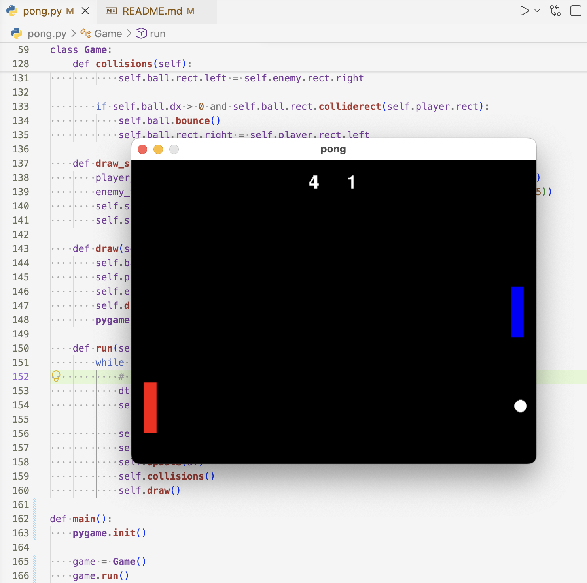

# Pong (Pygame)



A simple Pong clone written in Python using Pygame.

This project was created to practice object-oriented programming, game loops, delta time movement, collision detection, and basic game architecture.

## Features

- Player vs AI
- Ball acceleration after each paddle hit
- Score tracking
- Win condition
- Delta time based movement
- Object-oriented architecture

## Controls

| Key | Action |
|------|--------|
| ↑ | Move Up |
| ↓ | Move Down |
| Q | Quit |

## Project Structure

```
project/
│
├── main.py
├── settings.py
└── README.md
```

## Architecture

The project is built around three main classes:

- **Game** – manages the game loop, input, updates, collisions, drawing, and score.
- **Ball** – handles movement, bouncing, goals, and resetting.
- **Paddle** – handles paddle movement and rendering.

The main loop follows this order:

```
Events
    ↓
Input (dt)
    ↓
Update (dt)
    ↓
Collision
    ↓
Draw
```

## Installation

Install Pygame:

```bash
pip install pygame
```

Run:

```bash
python main.py
```

## What I Learned

During this project I practiced:

- Object-Oriented Programming (OOP)
- Separating responsibilities between classes
- Game loop design
- Delta time movement
- Collision detection
- Basic AI
- Code organization and refactoring

## Future Improvements

- Better collision response
- Ball reflection angle based on hit position
- Main menu
- Pause menu
- Sound effects
- Difficulty levels
- Restart after game over